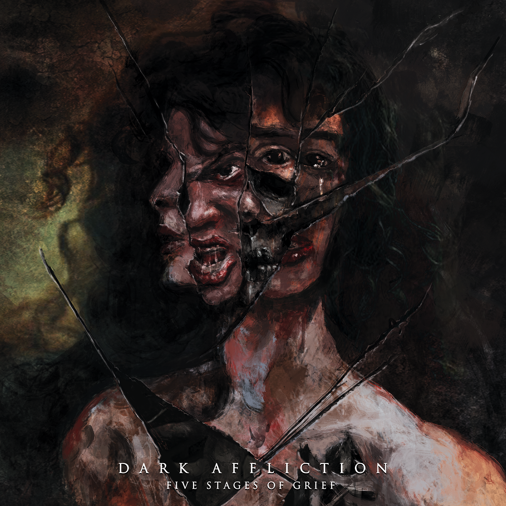

<h1 align="center">🎶 Dark Affliction – <i>Five Stages of Grief</i></h1>

  

<b>Post-Black Metal | Doom</b> 
My solo music project – Debut concept album

---

## 📀 Tracklist
0. Intro  
1. Denial  
2. Anger  
3. Bargaining  
4. Depression  
5. Acceptance  

---

## 🎧 Listen
  
  
  

---

## ⚙️ Recording & Workflow
- **DAW**: REAPER (home demos) → Studio (final production & mixing)  
- **Bass**: Yamaha BB434 (direct input + effects)  
- **Electric Guitars**: LTD Deluxe (Seymour Duncan pickups)  
- **Classical / Acoustic Guitars**: Alhambra & Yamaha (studio recordings) 
- **Drums**: MIDI sketches in REAPER → recorded live in studio  
- **Plugins / FX (for demos)**:  
  - Ugritone (RIP) – various packs (e.g. KVLT Drums, Doom kits)  
  - Bias FX (guitar & bass tones)  
  - Neural DSP (amp sims & processing)  
  - iZotope Ozone (demo mastering)  
  - etc. – the usual suspects

---

## 🖤 About
**Dark Affliction** blends intense riffs, blackened atmospheres, and doom-inspired heaviness.  
*Five Stages of Grief* is a concept album exploring the emotional journey through denial, anger, bargaining, depression, and acceptance — preceded by an atmospheric **Intro** that sets the tone.  

---

  <i>"Grief is love with nowhere to go." – Jamie Anderson</i>

